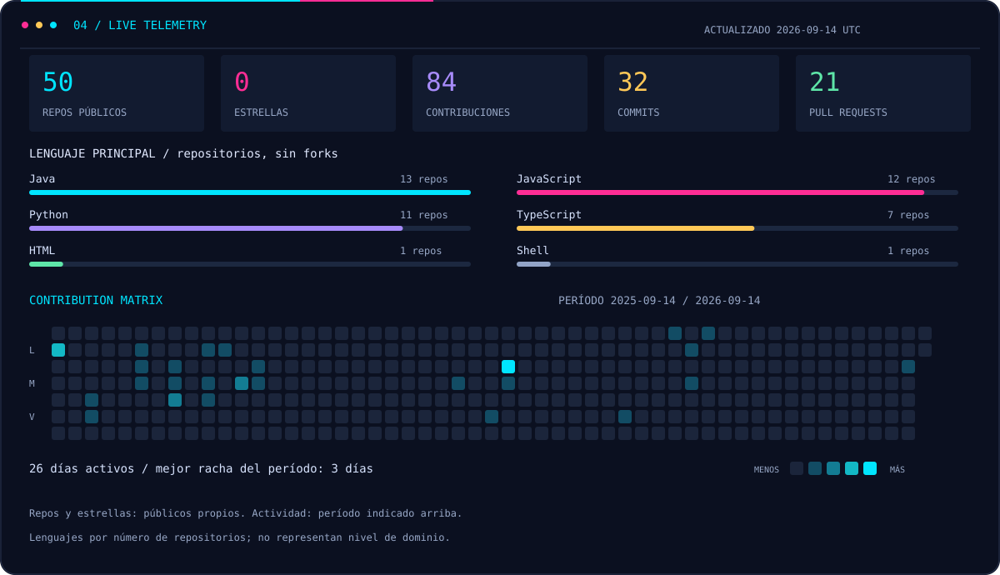

<div align="center">



**Desarrollo web · APIs · Simulación · Experimentos con Python**

Construyo interfaces, conecto servicios y convierto ideas en proyectos que funcionan.

[](https://github.com/CristianSinoe?tab=repositories)
[](https://github.com/CristianSinoe/gridrobot)

</div>

### `01 / whoami`

```javascript
const cristian = {
  nombre: "Cristian Sinoe Hernández Ruiz",
  formación: "Ingeniería de Software · Universidad Veracruzana",
  lenguajes: ["Java", "Python", "JavaScript", "TypeScript"],
  construyendo: ["Aplicaciones web", "APIs REST", "Simuladores"],
  explorando: ["Inteligencia artificial", "Seguridad", "Automatización"],
  filosofía: "Si puedo imaginarlo, puedo intentar programarlo."
};
```

### `02 / tech arsenal`

Tecnologías presentes en mis repositorios. Siempre hay algo nuevo por aprender.

<table>
<tr><td><strong>Lenguajes</strong></td><td>

</td></tr>
<tr><td><strong>Frontend</strong></td><td>

</td></tr>
<tr><td><strong>Backend y datos</strong></td><td>

</td></tr>
<tr><td><strong>Herramientas</strong></td><td>

</td></tr>
</table>

`REST APIs` · `WebSockets` · `JWT / OTP` · `Spring Security` · `JPA / Hibernate`

### `03 / mission control`

<table>
<tr>
<td width="50%" valign="top">

#### [GRIDBOT](https://github.com/CristianSinoe/gridrobot)

Simulador de robots sobre una cuadrícula. Interfaz web, API con WebSocket y un motor de simulación compartido.

**TypeScript · React · Vite · Prisma · Docker**

</td>
<td width="50%" valign="top">

#### [Auth MFA](https://github.com/CristianSinoe/auth-mfa-spring-react)

Autenticación multifactor con registro, inicio de sesión, códigos OTP por correo y acceso protegido con JWT.

**Java · Spring Boot · React · PostgreSQL**

</td>
</tr>
<tr>
<td width="50%" valign="top">

#### [TutorLink](https://github.com/CristianSinoe/tutorlink-academic)

Proyecto académico TutorLink. Una parte de mi recorrido construyendo software y llevando ideas al código.

**JavaScript · Proyecto académico**

</td>
<td width="50%" valign="top">

#### [Laboratorio Python](https://github.com/CristianSinoe?tab=repositories&language=python)

Prácticas y experimentos de inteligencia artificial: desde clasificación de correo hasta redes de Hopfield.

**Python · Inteligencia artificial · Aprendizaje**

</td>
</tr>
</table>

### `04 / live telemetry`



<details>
<summary>Cómo leer las estadísticas</summary>

Los repositorios y estrellas cuentan proyectos públicos propios, sin forks. Los lenguajes representan el número de repositorios con cada lenguaje principal, **no porcentajes de dominio ni líneas de código**. Las contribuciones y el mapa de actividad corresponden al período indicado en el panel; su visibilidad depende de GitHub y del token usado.

Las imágenes se guardan en este repositorio y se regeneran diariamente con GitHub Actions. La fecha de la última actualización aparece en el panel.

</details>

### `05 / beyond the code`

- Me interesa conectar interfaces con simulaciones y lógica que se pueda ver en acción.
- Exploro cómo construir flujos de autenticación y proteger APIs.
- Uso Python para experimentar con inteligencia artificial y aprender haciendo.
- Me gusta trabajar en distintas capas de una aplicación: interfaz, backend y datos.

<div align="center">

---

**`> build. break. learn. repeat_`**

Gracias por visitar mi rincón de GitHub. Explora un proyecto, revisa el código y acompaña el siguiente experimento.

[**Explorar todos los proyectos ↗**](https://github.com/CristianSinoe?tab=repositories)

</div>
