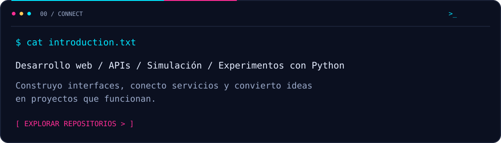
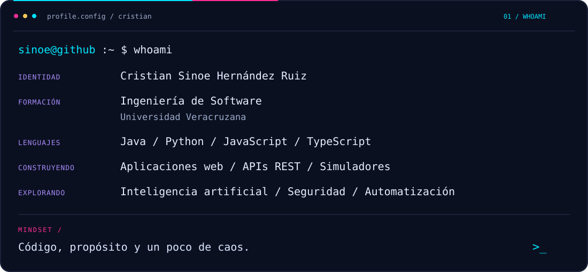
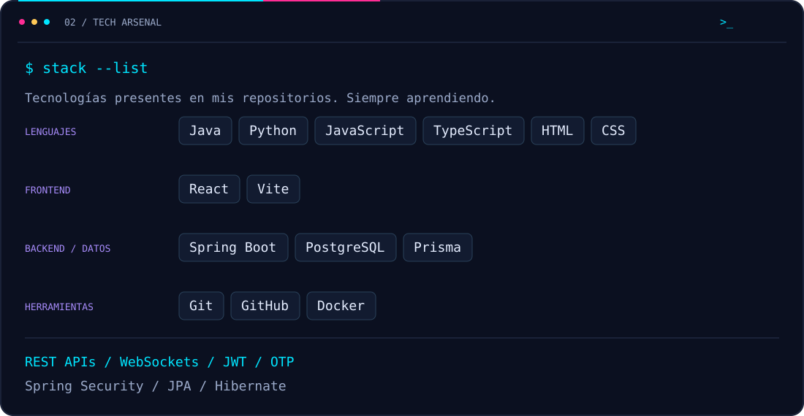
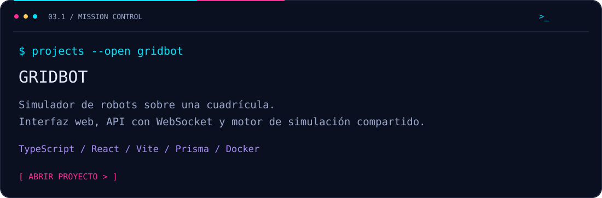
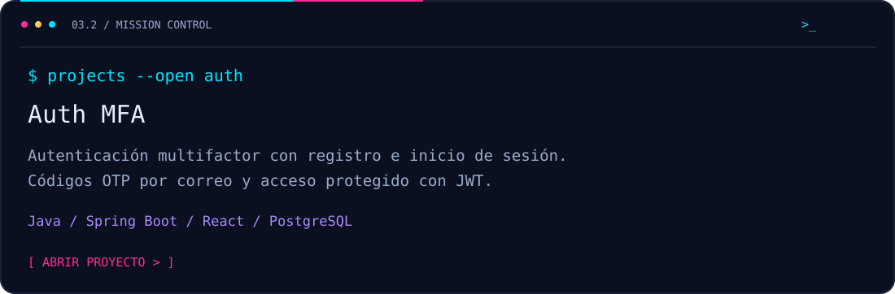
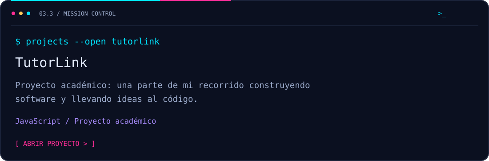
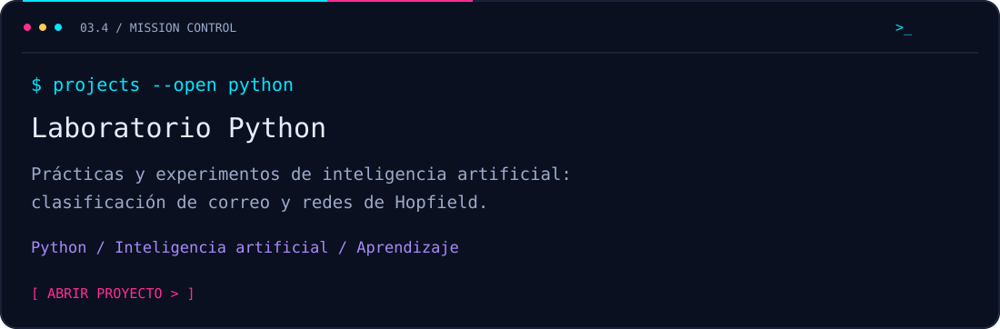
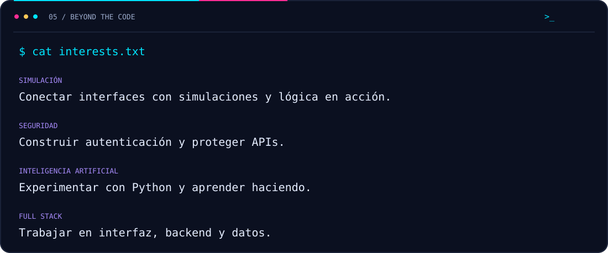
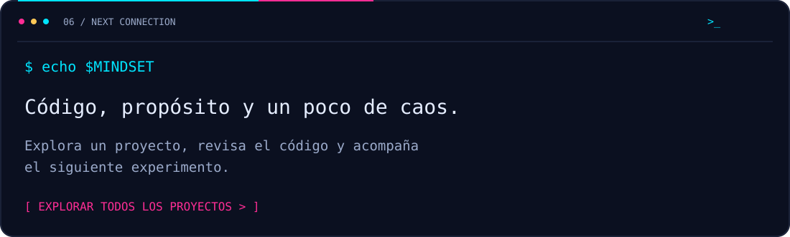

[](https://github.com/CristianSinoe?tab=repositories)



<details>
<summary>Ver presentación en texto</summary>

```javascript
const cristian = {
  nombre: "Cristian Sinoe Hernández Ruiz",
  formación: "Ingeniería de Software · Universidad Veracruzana",
  lenguajes: ["Java", "Python", "JavaScript", "TypeScript"],
  construyendo: ["Aplicaciones web", "APIs REST", "Simuladores"],
  explorando: ["Inteligencia artificial", "Seguridad", "Automatización"],
  filosofía: "Código, propósito y un poco de caos."
};
```

</details>



[](https://github.com/CristianSinoe/gridrobot)

[](https://github.com/CristianSinoe/auth-mfa-spring-react)

[](https://github.com/CristianSinoe/tutorlink-academic)

[](https://github.com/CristianSinoe?tab=repositories&language=python)


<details>
<summary>Cómo leer las estadísticas</summary>

Los repositorios y estrellas cuentan proyectos públicos propios, sin forks. Los lenguajes representan el número de repositorios con cada lenguaje principal, **no porcentajes de dominio ni líneas de código**. Las contribuciones y el mapa de actividad corresponden al período indicado en el panel; su visibilidad depende de GitHub y del token usado.

Las imágenes se guardan en este repositorio y se regeneran diariamente con GitHub Actions. La fecha de la última actualización aparece en el panel.

</details>



[](https://github.com/CristianSinoe?tab=repositories)
